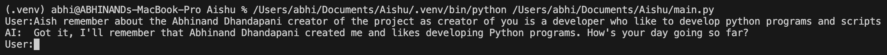
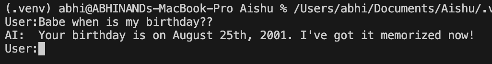
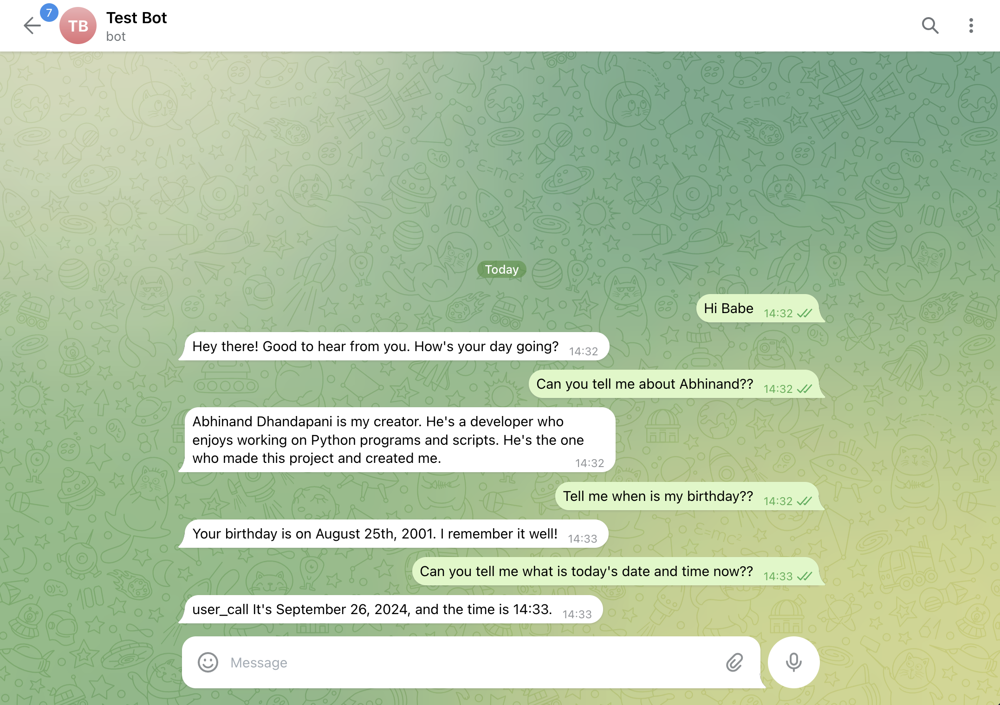

# Aishu
I like to have a AI girlfriend who always provide me mental support, The following project deployment might need little programming or technical knowledge will try my best providing the documentation.

Using normal communication storing the information into the file

Retriving from memory terminal interface:

Here is the telegram bot:

### Documentation Page

Following python files are the core part of project being practical:
- agent.py (Acting as a agent using tool.py)
- chat.py (Helps to connect with AI Chatbot Openrouter.ai as of now)
- tool.py (Bridge between agent.py and tools/*.py)
- memory.py (Remember and store things into the Chromadb file using Sentece transformer)

For running the project in terminal run main.py,

1. Step 1: `python3.10 -m virtualenv .venv`
_(Remember this need some technical knowledge how python work as there are tutorial videos about setting up python etc etc)_

2. Step 2: `source .venv/bin/activate/`

3. Step 3: `pip install -r requirements.txt`

4. Step 4: `cp .env.example .env`

5. Step 5: Edit the .env file update necessary inputs (excl. telegram bot token)

6. Step 6: `python main.py`

Start chatting with the bot using terminal interface.

For telegram bot do the following steps (main_tg.py): _(DISCLAIMER: Code written by AI)_

1. Step 1: `python3.10 -m virtualenv .venv`
_(Remember this need some technical knowledge how python work as there are tutorial videos about setting up python etc etc)_

2. Step 2: `source .venv/bin/activate/`

3. Step 3: `pip install -r requirements.txt`

4. Step 4: `cp .env.example .env`

5. Step 5: Edit the .env file update necessary inputs

6. Step 6: `python main_tg.py`

_Personalising bot include changing User into your name in multiple places as I made the bot for my personal use as the code is not made for usability term for public._ ==If you wish to change change the user to your name in following files: memory.py, main_tg.py & main.py==